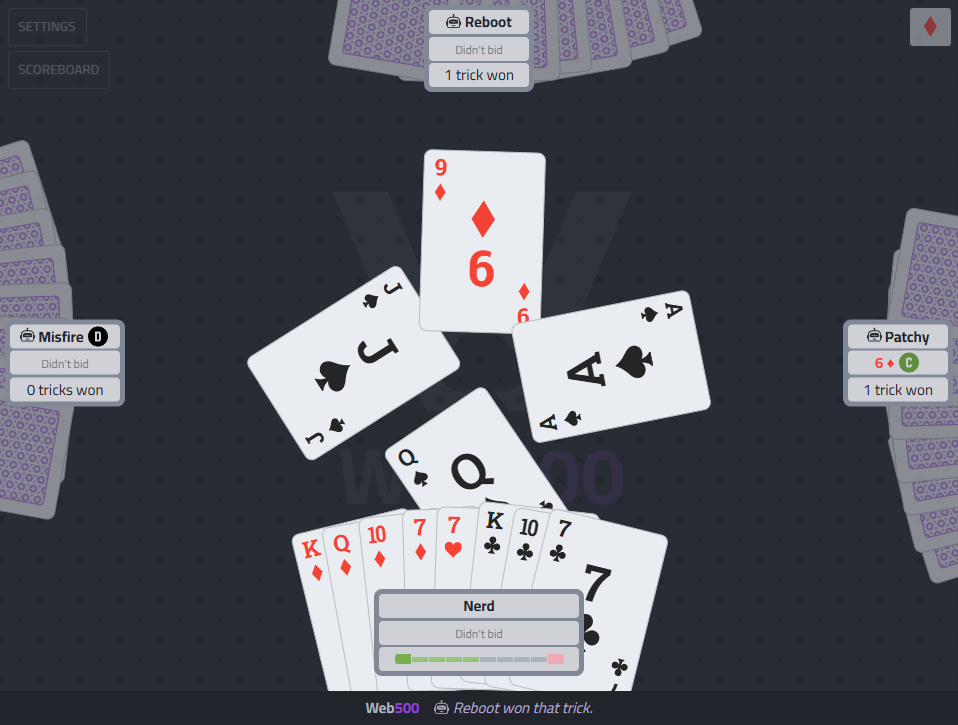
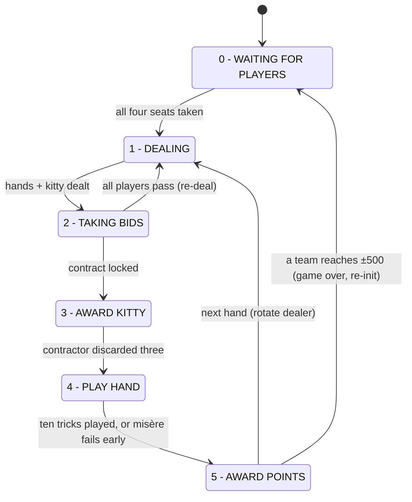

# Web500

A multiplayer web implementation of the Euchre based card game **500** — four players, fixed
partnerships, played in the browser. Rules follow the
[Australian Four-handed Five Hundred](https://www.pagat.com/euchre/500.html) variant as
described on pagat.com, which is the project's rules reference.

The server is a small Python/Flask app that holds any number of concurrent tables in
memory, each an authoritative game in its own right, and pushes full game state to every
browser connected to that table over Socket.IO. The client is a single-page jQuery UI
that renders whatever the server sends — no game logic runs in the browser.



## Features

<details>
<summary><strong>Full four-handed Australian 500 flow</strong></summary>

seating/lobby, dealing (43-card deck with joker), bidding, kitty award and discard,
trick play, and scoring, driven by a server-side state machine.

</details>

<details>
<summary><strong>Multiple tables</strong></summary>

pick an existing table (seeing who's already seated where) or create a new one after
logging in; any number can run at once. Generic auto-numbered names ("TABLE 1",
"TABLE 2", ...); a full table can't be joined by a newcomer; a table left empty for a
while is automatically cleaned up.

</details>

<details>
<summary><strong>Correct special-card handling</strong></summary>

joker as highest trump, left/right bowers, follow-suit enforcement including the
tricky edge cases (holding only the left bower of the led suit, joker when trumps are
led, etc.). In No Trumps and Misère, leading the joker requires nominating a suit the
others must follow (chosen in a temporary panel); a nominated suit must not have been
led earlier in the hand, and once all four suits have been led the joker may only be
led to the last trick. A contractor holding the joker may instead pre-nominate its
suit before the first lead, making it the highest card of that suit for the whole
hand.

</details>

<details>
<summary><strong>Legal-move hints</strong></summary>

the server sends each player the set of cards they may legally play; the client dims
everything else.

</details>

<details>
<summary><strong>Bidding rules</strong></summary>

Avondale score table, re-deal when all four players pass, and the last remaining
bidder gets one chance to increase their own bid before the contract locks. A
toggleable bid-value reference table (including the slam rule) is available while
bidding and from the scoreboard.

</details>

<details>
<summary><strong>Scoring</strong></summary>

Avondale table (6 Spades 40 … 10 No Trumps 520), opponents score 10 per trick, "slam"
rule (winning all 10 tricks scores a minimum of 250), first team to ±500 with unequal
scores ends the game.

</details>

<details>
<summary><strong>Misère</strong></summary>

biddable only over a bid of seven (ranks between 8 Spades and 8 Clubs per the points
table, so only 8 Clubs or higher outbids it), the contractor plays alone while their
partner sits out, the contract fails the moment the contractor wins a trick, and
scores ±250 with the opponents scoring nothing. (Open Misère is not implemented.)

</details>

<details>
<summary><strong>Per-hand scoreboard</strong></summary>

running totals with each hand's contract, tricks and points, in a scrollable modal.

</details>

<details>
<summary><strong>In-game rules reference</strong></summary>

a scrollable rules modal covering the Australian four-handed game in plain language
(credited to pagat.com), including the game's current limitations; reachable from the
lobby, scoreboard and settings modals.

</details>

<details>
<summary><strong>Persistence</strong></summary>

every table autosaves at every safe checkpoint and is restored automatically when the
service restarts, so a server bounce doesn't kill any game in progress. A separate
manual checkpoint slot per table supports save/load during development.

</details>

<details>
<summary><strong>Push notifications (optional)</strong></summary>

pings a self-hosted [ntfy](https://ntfy.sh/) server whenever a human takes a seat at a
table. Off by default; see [Notifications](#notifications-optional) below to enable it.

</details>

<details>
<summary><strong>Mobile-friendly</strong></summary>

responsive layout, modals sized for phones in both orientations, iOS-specific fixes
(non-emoji suit glyphs, homescreen icon).

</details>

<details>
<summary><strong>Natural card layout</strong></summary>

cards sit with a little random offset/rotation (re-rolled each deal and each trick)
instead of pixel-perfect alignment; switchable back to "Perfect" per user.

</details>

<details>
<summary><strong>User settings</strong></summary>

a settings modal with the Perfect/Natural card layout toggle (persisted per browser
via localStorage), a clear-saved-settings button (wipes all `web500*` localStorage
keys and reloads), and logout. Admin users get an extra admin-only section in the same
modal (a table selector scoping the actions below to any table; test mode, skip
delays, checkpoint save/load/clear, table reinit, service uptime + restart), rendered
server-side only for them.

</details>

<details>
<summary><strong>Simple auth</strong></summary>

display name + shared game passcode login with signed session cookies; every action's
identity comes from the server-side session, and the admin tools are gated to listed
admin users.

</details>

<details>
<summary><strong>Search-engine opt-out</strong></summary>

`robots.txt` disallow, `noindex` meta tags, and a global `X-Robots-Tag` header keep
the site (and its assets) out of search indexes.

</details>

<details>
<summary><strong>Bot players</strong></summary>

an ADD BOTS button in the lobby fills the empty seats with server-side bot players so
a game never has to wait on a fourth human. They bid, discard and play with
human-like personalities (imperfect memory, varying confidence, occasional
miscalculations, individual pacing) and only ever see what a human in their seat
could see. Full behaviour model in [BOTS.md](docs/BOTS.md).

</details>

<details>
<summary><strong>Test mode</strong></summary>

one human can exercise the whole game against three built-in bots that bid, discard
and play random legal cards.

</details>

## Installation

Runs on any Linux box with Python 3 and systemd. The steps below install it as a
service on port 4030.

**1. Get the code and install dependencies:**

```bash
git clone https://github.com/danricho/web500.git /opt/web500
cd /opt/web500

python3 -m venv venv
venv/bin/pip install -r requirements.txt
```

**2. Create the service.** Write `/etc/systemd/system/web500.service` (adjust `User`
and the paths if you installed somewhere other than `/opt/web500`):

```ini
[Unit]
Description=Web500 card game server
After=network.target

[Service]
Type=simple
Restart=always
RestartSec=10
User=youruser
WorkingDirectory=/opt/web500
Environment="PYTHONUNBUFFERED=1"
ExecStart=/opt/web500/venv/bin/gunicorn -b :4030 -w 1 --threads 100 main:app

[Install]
WantedBy=multi-user.target
```

The game lives in process memory, so gunicorn must keep **exactly one worker**
(`-w 1`); concurrency comes from threads.

**3. Enable and start:**

```bash
sudo systemctl daemon-reload
sudo systemctl enable --now web500.service
systemctl status web500.service

# follow the logs (every state transition and action is logged, with colour)
journalctl -u web500.service -f
```

**4. Set your passcode.** The first start creates `data/auth.json` with a random
passcode (`{"passcode": ..., "admin_users": [...]}`). Edit it to set your own passcode,
add your display name to `admin_users` if you want the in-game admin tools, then
`sudo systemctl restart web500.service`.

**5. (Optional) Push notifications when a player joins.** The first start also creates
`data/ntfy.json`, disabled by default:

```json
{"enabled": false, "server": "https://ntfy.example.com", "topic": "web500", "auth_token": null}
```

To get a push notification (via [ntfy](https://ntfy.sh/)) whenever a human sits down at
a table, set `enabled: true` and point `server`/`topic` at your ntfy instance
(`auth_token` is only needed if that server requires one). No restart needed — it's
re-read on every notification. Bot seatings (ADD BOTS, admin test mode) never notify.

**6. Play.** Open `http://your-server:4030`, log in with a display name + the
passcode, pick or create a table, and take a seat. The ADD BOTS button fills empty
seats with bot players.

Restarting the service does **not** lose any game in progress — every table is
restored from its own save under `data/tables/` at startup.

**Updating:** `git pull`, then `venv/bin/pip install -r requirements.txt` (in case
dependencies changed) and restart the service.

### Player identity & auth

Simple shared-passcode auth, table-agnostic — the same login works for every table.
Players log in with a display name + the passcode; a signed session cookie (90 days)
keeps them in, and their name is their game identity. Names are compared
case-insensitively but stored and displayed as first written — logging in as "HENRY"
while "Henry" is already seated at the table you join resumes that seat under the
original spelling. Socket actions take the name from the server-side session, never
from client-supplied data, so players can't act as each other. The session-signing key
is auto-generated into `data/secret_key.txt` so logins survive restarts. `admin_users` in
`data/auth.json` lists the names allowed to use the admin endpoints and the settings
modal's admin section.

### Notifications (optional)

A self-hosted [ntfy](https://ntfy.sh/) server can be pinged whenever a human takes a
seat — handy if you're not watching the browser tab. Off by default; see step 5 of the
installation instructions above to turn it on via `data/ntfy.json`.

## Architecture

File layout and file-by-file responsibilities live in
[DEVELOPMENT.md](docs/DEVELOPMENT.md#architecture). The core of it:

### The game state machine

`GameStateMachine` (in `game_state.py`) is a six-state FSM. One instance exists per
table — each table runs its own independent copy of this machine. The state is an
integer index into the `states` list:

| S   | State               | Driven by                                   |
| --- | ------------------- | ------------------------------------------- |
| 0   | WAITING FOR PLAYERS | `gui_sit()` — players claiming seats        |
| 1   | DEALING             | `auto_deal()`, queued on transition         |
| 2   | TAKING BIDS         | `gui_bid()` — bid/pass submissions          |
| 3   | AWARD KITTY         | `gui_discard()` — contractor discards three |
| 4   | PLAY HAND           | `gui_play()` — card plays, ten tricks       |
| 5   | AWARD POINTS        | `auto_points()`, queued on transition       |



## Developing

Everything deeper — running without systemd, how multiple tables work, the server/client
contract, state-machine mechanics, admin endpoints and test mode, persistence internals
and the card encodings — lives in [DEVELOPMENT.md](docs/DEVELOPMENT.md).

## Roadmap

Planned work, ranked by value/effort, lives in its own file:
[ROADMAP.md](docs/ROADMAP.md).

## License

[Apache License 2.0](LICENCE). Vendored front-end libraries (jQuery, Socket.IO,
normalize.css, skeleton.css) are MIT-licensed; in-page icons use paths from
[Bootstrap Icons](https://icons.getbootstrap.com) (MIT).
