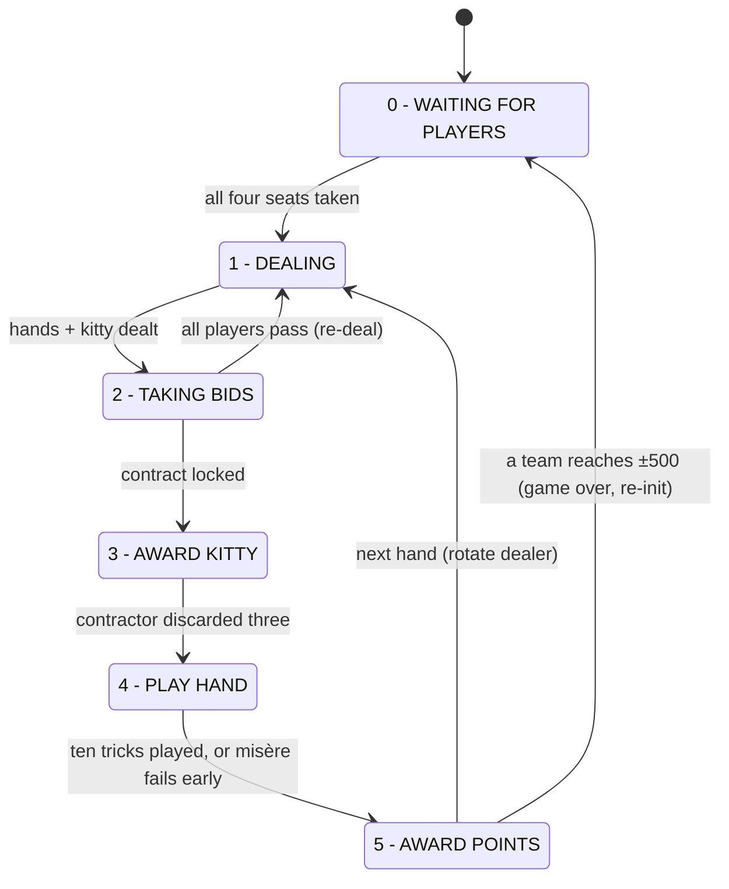

# Web500

A multiplayer web implementation of the Euchre based card game **500** — four players, fixed
partnerships, played in the browser. Rules follow the
[Australian Four-handed Five Hundred](https://www.pagat.com/euchre/500.html) variant as
described on pagat.com, which is the project's rules reference.

The server is a small Python/Flask app that holds a single authoritative game in memory
and pushes full game state to every connected browser over Socket.IO. The client is a
single-page jQuery UI that renders whatever the server sends — no game logic runs in the
browser.


## Features

- **Full four-handed Australian 500 flow** — seating/lobby, dealing (43-card deck with
  joker), bidding, kitty award and discard, trick play, and scoring, driven by a
  server-side state machine.
- **Correct special-card handling** — joker as highest trump, left/right bowers,
  follow-suit enforcement including the tricky edge cases (holding only the left bower of
  the led suit, joker when trumps are led, etc.). In No Trumps and Misère, leading the
  joker requires nominating a suit the others must follow (chosen in a temporary panel);
  a nominated suit must not have been led earlier in the hand, and once all four suits
  have been led the joker may only be led to the last trick. A contractor holding the
  joker may instead pre-nominate its suit before the first lead, making it the highest
  card of that suit for the whole hand.
- **Legal-move hints** — the server sends each player the set of cards they may legally
  play; the client dims everything else.
- **Bidding rules** — Avondale score table, re-deal when all four players pass, and the
  last remaining bidder gets one chance to increase their own bid before the contract
  locks. A toggleable bid-value reference table (including the slam rule) is available
  while bidding and from the scoreboard.
- **Scoring** — Avondale table (6 Spades 40 … 10 No Trumps 520), opponents score 10 per
  trick, "slam" rule (winning all 10 tricks scores a minimum of 250), first team to ±500
  with unequal scores ends the game.
- **Misère** — biddable only over a bid of seven (ranks between 8 Spades and 8 Clubs
  per the points table, so only 8 Clubs or higher outbids it),
  the contractor plays alone while their partner sits out, the contract fails the moment
  the contractor wins a trick, and scores ±250 with the opponents scoring nothing.
  (Open Misère is not implemented.)
- **Per-hand scoreboard** — running totals with each hand's contract, tricks and points,
  in a scrollable modal.
- **In-game rules reference** — a scrollable rules modal covering the Australian
  four-handed game in plain language (credited to pagat.com), including the game's
  current limitations; reachable from the lobby, scoreboard and settings modals.
- **Persistence** — the live game autosaves at every safe checkpoint and is restored
  automatically when the service restarts, so a server bounce doesn't kill the game.
  A separate manual checkpoint slot supports save/load during development.
- **Mobile-friendly** — responsive layout, modals sized for phones in both orientations,
  iOS-specific fixes (non-emoji suit glyphs, homescreen icon).
- **Natural card layout** — cards sit with a little random offset/rotation (re-rolled
  each deal and each trick) instead of pixel-perfect alignment; switchable back to
  "Perfect" per user.
- **User settings** — a settings modal with the Perfect/Natural card layout toggle
  (persisted per browser via localStorage), a clear-saved-settings button (wipes all
  `web500*` localStorage keys and reloads), and logout. Dev users get an extra
  dev-only section in the same modal (test mode, skip delays, checkpoint save/load/
  clear, service uptime + restart), rendered server-side only for them.
- **Simple auth** — display name + shared game passcode login with signed session
  cookies; every action's identity comes from the server-side session, and the dev
  tools are gated to listed dev users.
- **Search-engine opt-out** — `robots.txt` disallow, `noindex` meta tags, and a global
  `X-Robots-Tag` header keep the site (and its assets) out of search indexes.
- **Bot players** — an ADD BOTS button in the lobby fills the empty seats with
  server-side bot players so a game never has to wait on a fourth human. They bid,
  discard and play with human-like personalities (imperfect memory, varying
  confidence, occasional miscalculations, individual pacing) and only ever see what a
  human in their seat could see. Full behaviour model in [BOTS.md](BOTS.md).
- **Test mode** — one human can exercise the whole game against three built-in bots that
  bid, discard and play random legal cards.

## Installation

Runs on any Linux box with Python 3 and systemd. The steps below install it as a
service on port 4030.

**1. Get the code and install dependencies:**

```bash
git clone https://github.com/danricho/web500.git /opt/web500
cd /opt/web500

python3 -m venv venv
venv/bin/pip install -r requirements.txt
```

**2. Create the service.** Write `/etc/systemd/system/web500.service` (adjust `User`
and the paths if you installed somewhere other than `/opt/web500`):

```ini
[Unit]
Description=Web500 card game server
After=network.target

[Service]
Type=simple
Restart=always
RestartSec=10
User=youruser
WorkingDirectory=/opt/web500
Environment="PYTHONUNBUFFERED=1"
ExecStart=/opt/web500/venv/bin/gunicorn -b :4030 -w 1 --threads 100 main:app

[Install]
WantedBy=multi-user.target
```

The game lives in process memory, so gunicorn must keep **exactly one worker**
(`-w 1`); concurrency comes from threads.

**3. Enable and start:**

```bash
sudo systemctl daemon-reload
sudo systemctl enable --now web500.service
systemctl status web500.service

# follow the logs (every state transition and action is logged, with colour)
journalctl -u web500.service -f
```

**4. Set your passcode.** The first start creates `data/auth.json` with a random
passcode (`{"passcode": ..., "dev_users": [...]}`). Edit it to set your own passcode,
add your display name to `dev_users` if you want the in-game dev tools, then
`sudo systemctl restart web500.service`.

**5. Play.** Open `http://your-server:4030`, log in with a display name + the
passcode, and take a seat. The ADD BOTS button fills empty seats with bot players.

Restarting the service does **not** lose the game in progress — it is restored from
`data/autosave.json` at startup.

**Updating:** `git pull`, then `venv/bin/pip install -r requirements.txt` (in case
dependencies changed) and restart the service.

### Player identity & auth

Simple shared-passcode auth. Players log in with a display name + the passcode; a
signed session cookie (90 days) keeps them in, and their name is their game identity.
Names are compared case-insensitively but stored and displayed as first written —
logging in as "HENRY" while "Henry" is seated resumes that seat under the original
spelling. Socket actions take the name from the server-side session, never from
client-supplied data, so players can't act as each other. The session-signing key is
auto-generated into `data/secret_key.txt` so logins survive restarts. `dev_users` in
`data/auth.json` lists the names allowed to use the dev endpoints and the settings
modal's dev section.

## Architecture

```
main.py               Flask app + Socket.IO event handlers; thin routing layer only
game_state.py         GameStateMachine — all game rules, state and flow (the core file)
bots.py               bot players: lobby-seatable PlayerBot (view-restricted, per-bot
                      personality) + the predictable random dev test-mode bot
playing_cards.py      Card / Deck classes, suit & rank constants, trump-aware sorting
threaded_schedule.py  ThreadedSchedule — worker thread + job queue + `schedule` poller;
                      a failing job logs its traceback and fires the on_error hook
                      (wired to a SERVER ERROR toast); the worker always survives
dotdict.py            dict subclass with attribute access (players/teams/bids)
templates/game_client.j2.html   single-page client UI (Jinja2)
static/game_client.js           client logic: renders pushed state, emits player actions
data/                 runtime files (gitignored): auth, saves, session key
```

The server is authoritative; clients never compute game logic. Every connected browser
receives the entire game state on every push and emits player actions (seat, bid,
discard, play) back as Socket.IO events. Hiding opponents' cards is a client-side
rendering concern only.

### The game state machine

`GameStateMachine` (in `game_state.py`) is a six-state FSM. The state is an integer
index into the `states` list:

| S   | State               | Driven by                                   |
| --- | ------------------- | ------------------------------------------- |
| 0   | WAITING FOR PLAYERS | `gui_sit()` — players claiming seats        |
| 1   | DEALING             | `auto_deal()`, queued on transition         |
| 2   | TAKING BIDS         | `gui_bid()` — bid/pass submissions          |
| 3   | AWARD KITTY         | `gui_discard()` — contractor discards three |
| 4   | PLAY HAND           | `gui_play()` — card plays, ten tricks       |
| 5   | AWARD POINTS        | `auto_points()`, queued on transition       |



### Player bots

The lobby's ADD BOTS button fills empty seats with server-side bot players — they
bid, discard and play with human-like personalities (imperfect memory, varying
confidence, occasional miscalculations) and only ever see what a human in their
seat could see. Design notes, behaviour model and phase status live in
[BOTS.md](BOTS.md).

## Developing

Everything deeper — running without systemd, the server/client contract,
state-machine mechanics, dev endpoints and test mode, persistence internals and the
card encodings — lives in [DEVELOPMENT.md](DEVELOPMENT.md).

## Roadmap

The single source of truth for planned work, ranked by value/effort, best bang-for-buck first.
Short version: everything here is opportunistic - nothing gates hosting.
Each item's summary line is the quick reference — the indented detail underneath
carries the diagnostics and fix shapes.

1. **Logging audit of a real game** — capture the full server log of a real game
   (humans + bots, start to game over), read it end to end, and turn what's found into
   a concrete list of log improvements. Cheap, and everything else about improving the
   logs depends on it.

   _Detail (easy, mostly reading):_ save the journal for one complete real game
   (`journalctl -u ... > game.log`), then walk it asking, per line: did this earn its
   place? Look for noise (keep-alive/push chatter, repeated poll output, anything
   fired once a second), missing signal (can every bid, play, transition and error be
   reconstructed without the client?), redundancy (same event logged at two layers),
   and readability (are the colour conventions and prefixes consistent; can a hand be
   followed by eye?). Output is not code — it's a ranked list of specific changes
   (drop/demote these lines, add these, reformat those) appended here as follow-up
   items.

1. **Change player without re-entering the passcode** — the session already proves the
   passcode was entered once; switching display name shouldn't demand it again. Small
   convenience win for shared/family devices.

   _Detail (easy, 1–2 hours, one design caveat):_ today "authenticated" simply means
   `session['username']` is set, so a name change currently requires the full login
   round-trip. Add an authed marker at login (e.g. `session['authed'] = True`), then a
   "CHANGE PLAYER" action in the settings modal that clears only the username and
   routes to a name-entry form which skips the passcode field when `authed` is set.
   The caveat: seats are keyed by name, and there is no un-sit mechanism — a seated
   player who changes name orphans their old seat until reinit. So either restrict the
   action to players not currently seated in a live hand, or present it as "switch to
   another (possibly seated) identity" — resuming an existing seat under its original
   spelling already works via the case-insensitive name match. Also exclude `B|`/`D|`
   prefixed names so nobody logs in as a bot.

1. **State-change refactor** — cheap but zero player value; half stale already. Finish
   cheaply or close.

   _Detail (medium):_ partly stale: `move_state()` already exists. Remaining work is
   thinning repetitive debug/dialog blocks per branch of `state_trans()`.

1. **Let a lone winning bidder resign instead of contracting** — when everyone else has
   passed, offer "resign" alongside the increase option, so a regretted bid needn't be
   played out. Contained change, but needs a scoring decision before any code.

   _Detail (medium, needs a rules decision first):_ the hook already exists — once only
   one bidder remains, `gui_bid()` flags them `bid.passed = "WINNER_INCREASE_OPTION"`
   and `dlg_bid_increase_option()` offers increase-or-pass. Resign becomes a third
   choice at that same moment, before the kitty is seen. The open question is scoring,
   and it must be settled first: does the would-be contractor lose the bid value, do
   the opponents score anything, or is it a plain re-deal (with or without a penalty)?
   Check the pagat "Australian Four-handed Five Hundred" section for a sanctioned
   variant rather than inventing one — and note the bidder here has not yet seen the
   kitty, so this is regret at the bid, not at the hand. Touches: `gui_bid()` (a new
   flag value beside `"WINNER"` / `"WINNER_INCREASE_OPTION"`), the S2 branch of
   `state_trans()` (route to re-deal or scoring instead of AWARD KITTY), a new `dlg_*`
   builder, the bidding box UI, and the rules modal.

1. **Multiple tables** — choose a table and spawn another when more than 4 people want
   to play. High value the moment a fifth player shows up, but it touches the
   single-game assumption everywhere.

   _Detail (hard, architectural):_ everything currently assumes one shared
   `GameStateMachine`: one in-memory instance, one autosave, and every Socket.IO push
   broadcast to all clients. Multi-table needs: a table registry with a lobby step to
   pick or create a table; independent join passcodes/codes per table so groups stay
   separate; per-table Socket.IO rooms (stop broadcasting every game to every client);
   per-table autosave/checkpoint files; and name deconfliction — the session display
   name is the identity key today, so the same name at _different_ tables must be
   allowed (scope identity to table id + name) while still blocked within one table.
   Dev/test endpoints (`/api/reinit`, `/dev/*`, test mode/bots) also need to become
   table-aware.

1. **Save/restore idle windows** — saves written between "action queued work" and
   "worker ran it" restore into a stuck game; several known windows, all rare races.
   Low priority.

   _Detail (medium, touches fragile spots):_ root cause: `gui_*` actions run on socket
   handler threads and autosave right after each action, but the follow-up work
   (`state_trans`) sits on the job queue, and **queued-but-unexecuted jobs are not part
   of the save**. A save written in that gap restores into a state whose trigger has
   evaporated. Known windows:
   - **WAITING FOR PLAYERS** with all 4 seats named (4th `gui_sit` autosaves before
     `state_trans` runs) — stuck; re-seating won't re-trigger.
   - **TAKING BIDS** with all players passed (re-deal pending) — stuck, focus `None`.
   - **TAKING BIDS** with a `bid.passed == "WINNER"` flag (kitty award pending) — stuck.
   - **PLAY HAND** mid-trick with every active player's table card set (trick
     evaluation pending) — stuck; the original headline case.
   - **PLAY HAND** hand-complete / misère-failed (scoring transition pending) — stuck.
   - **PLAY HAND** between tricks during the won-trick pause, if a _concurrent_ action
     autosaves — stuck and unrecoverable: the trick winner exists only in a local
     variable, so no redo can know who leads.
   - **AWARD POINTS** mid-dialog via a concurrent save — not idle but worse: restore
     re-queues `auto_points` and applies the scores twice.

   Fix shapes: defensively queue `state_trans` on restore into S0 / TAKING BIDS /
   PLAY HAND (it no-ops when nothing is due) + a trick-evaluation redo for the full
   table; set `player_focus` to the trick winner _before_ the won-trick pause (or
   persist a `last_trick_winner`); clear/flag bids immediately after scores are applied
   in `auto_points`.

1. **Save game transcript** — record who played what in what order per trick plus all
   bid events (probably timestamped), persisted per game, served as an HTML table at
   an endpoint.

   _Detail (medium, substrate exists):_ the public event logs already capture exactly
   the right events in order — `bid_history` (every bid/pass with seat) and
   `trick_history` (every card with seat, per trick) were built for the bots — but they
   reset each deal (`auto_deal`) and aren't timestamped. Needed: add timestamps at
   append time, accumulate per-hand snapshots across the game (plus the contract and
   points outcome per hand), persist to disk on game end (reuse the `save_state`
   atomic-write pattern; finished games currently only append to the in-memory `games`
   list dumped by `/api/last-game`), and render an HTML table endpoint (hand → bids →
   tricks in play order, seat names resolved).

1. **Open Misère** — Misère logic now exists; the blocker is UI: no known way to show an
   exposed hand while staying usable on phones. Last.

   _Detail (hard, needs a design first):_ rules are Misère with the contractor's hand
   played face-up on the table (scores 500; check pagat for its exact bid ranking). The
   Misère engine now exists; the blocker is UI, not logic: no obvious way to display a
   fifth, exposed hand that stays usable on phone screens (portrait or landscape).
   Needs a design idea before any code.

1. **Player presence / disconnect notices (maybe, one day)** — toast "X lost
   connection" / "X is back online" and a per-seat indicator. Built once and
   deliberately reverted (2026-07-19): under the polling transport, disconnect
   detection was unreliable enough that fixing it (ping tuning, pagehide close,
   heartbeats) cost more complexity than a friendly table game justifies.

   _Detail (medium, design exists):_ the shape that worked: per-name socket-sid sets
   (multi-device players never false-alarm), only the last client dropping starts a
   ~30s debounce, only seated humans announced, "back online" only after an announced
   loss, per-player `disconnected` flag riding the state push for a chip icon.
   Revisit only if the transport story changes (e.g. websockets) or players actually
   ask for it.

## License

[Apache License 2.0](LICENCE). Vendored front-end libraries (jQuery, Socket.IO,
normalize.css, skeleton.css) are MIT-licensed; in-page icons use paths from
[Material Design Icons](https://materialdesignicons.com) (Apache 2.0).
